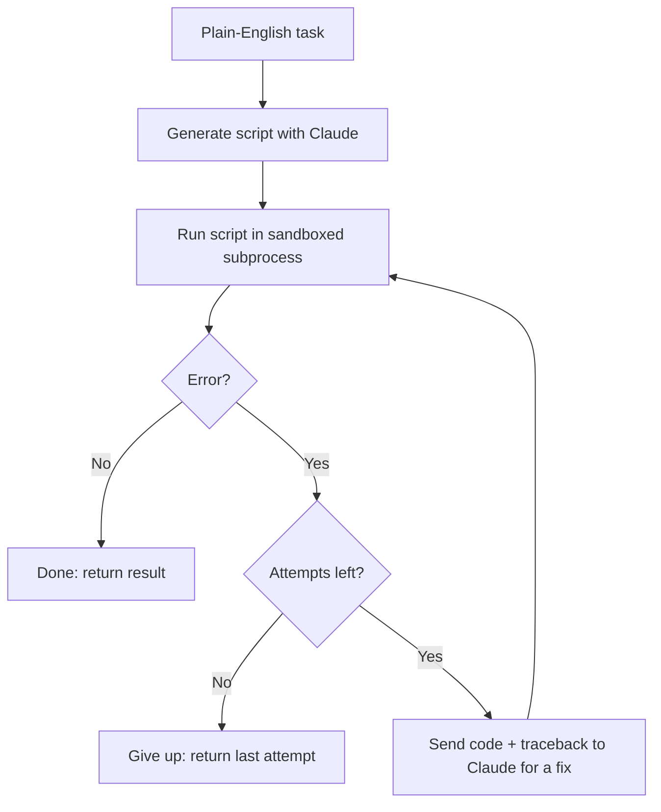

# selfheal

**selfheal** is a coding agent that takes a plain-English task, writes a
Python script to do it, runs it, and — if it errors — reads the traceback
and fixes its own code in a loop until it works or hits a retry limit.

Powered by [Claude](https://www.anthropic.com/claude) via the official
`anthropic` Python SDK.

```python
from selfheal import run

result = run("rename all .jpg files in ./photos by the date they were taken")

print(result.succeeded)      # True
print(result.final_code)     # the script that ended up working
print(result.result_output)  # its stdout
print(len(result.attempts))  # how many tries it took
```

Every attempt — code, output, error — is preserved in `result.attempts`, so
you can see exactly how the agent got there. Transparency is the point.

## How it works



1. **Generate** — Claude is asked for a single, self-contained Python script
   that accomplishes the task.
2. **Run** — the script executes in an isolated subprocess with a timeout,
   capturing stdout, stderr, and exit code.
3. **Error?** — if it exited cleanly, we're done.
4. **Fix** — otherwise, the code and the full traceback are sent back to
   Claude, which returns a corrected script.
5. **Repeat** — up to a configurable `max_attempts` (default 4), stopping
   early on success.

## Install

```bash
pip install selfheal          # once published to PyPI
# or, from source:
git clone https://github.com/YOUR_USERNAME/selfheal.git
cd selfheal
pip install -e .
```

Set your API key:

```bash
cp .env.example .env
# edit .env and set ANTHROPIC_API_KEY=sk-ant-...
```

## Usage

### CLI

```bash
selfheal "count the number of words in all .txt files in the current directory" --yes
```

The CLI streams each attempt live: the generated code, its output, the
error in red if it fails, and the fix that follows — clearly marking
success when it happens.


<!-- TODO: replace with a real recording of `selfheal` running end-to-end -->

Useful flags:

| Flag              | Meaning                                                              |
|-------------------|-----------------------------------------------------------------------|
| `--dry-run`       | Generate and print the script without executing it                   |
| `--yes`           | Required to actually execute generated code (see Safety below)       |
| `--max-attempts`  | Max generate-run-fix cycles (default: 4)                              |
| `--timeout`       | Seconds to allow each run before killing it (default: 30)             |
| `--workdir`       | Directory the script executes in (default: current directory)         |
| `--model`         | Claude model id to use                                                 |

### Python API

```python
from selfheal import run

result = run(
    "count the number of words in all .txt files in ./notes",
    max_attempts=4,
    timeout=30,
    workdir="./notes",
)

for i, attempt in enumerate(result.attempts, start=1):
    print(f"--- attempt {i} ---")
    print(attempt.code)
    print("succeeded:", attempt.succeeded)
```

### Web demo (Gradio)

```bash
pip install -e ".[web]"
python app.py
```

Opens a local Gradio UI where each attempt appears as its own step
(code → output/error → next fix). The same `app.py` deploys directly to
[Hugging Face Spaces](https://huggingface.co/spaces) — just push this repo
to a Space with an `ANTHROPIC_API_KEY` secret set.

## Safety

**Generated code runs on your machine. Review it before trusting it with
anything that matters.**

selfheal takes these precautions, but they are not a substitute for reading
the code Claude writes:

- Generated scripts are **never** run with `exec`/`eval` in-process — they
  always run as a separate `python` subprocess.
- Each run is bounded by a **timeout** (`--timeout`, default 30s) and killed
  if it's exceeded.
- Each run is confined to a **working directory** (`--workdir`) that
  relative file operations resolve against.
- The CLI **refuses to execute anything without an explicit `--yes`** flag.
  Use `--dry-run` first to see exactly what code would run.
- The agent loop has a **max attempt limit** (default 4) so it can't loop
  forever burning API credits.

None of this sandboxes against a determined adversarial script — it does
not use containers, seccomp, or filesystem/network isolation beyond the
working-directory convention above. Don't run selfheal against untrusted
tasks, and don't give it access to directories or credentials you wouldn't
hand to a script you hadn't read.

## Configuration

selfheal reads `ANTHROPIC_API_KEY` from the environment (or a `.env` file
via `python-dotenv`). The Claude model id is a single constant,
`DEFAULT_MODEL` in `selfheal/config.py`, so it's easy to swap.

## Development

```bash
pip install -e ".[dev,web]"
pytest          # tests mock the Anthropic API and subprocess execution — no API key needed, runs offline
ruff check .
```

See [CONTRIBUTING.md](CONTRIBUTING.md) for more.

## License

[MIT](LICENSE)
